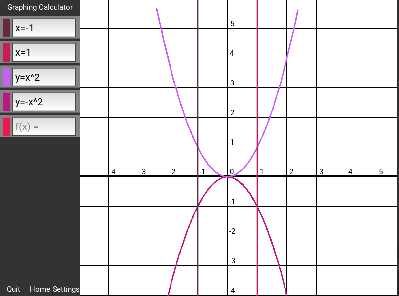

# Graphing Calculator

## About
Graphing Calculator using the Kivy Framework! 

## Features

- Create any equation using the sidebar

- Realtime Updating, used for when moving the graph

- Graph is Resizable to any window size

- Custom Equation Solver

### Bugs/WIP

- [ ] Fix minor sidebar bug with equation updating

- [ ] Minimizing window will cause program to crash

- [ ] Implement inequalities

- [ ] Add Graph Scaling

## Installation
#### Users

- Install pipenv: `pip install pipenv`
- Install dependencies: `pipenv sync`
- Run the program: `python -m "Graphing Calculator"`

#### Developers

- Install pipenv: `pip install pipenv`
- Install dependencies: `pipenv sync --dev`
